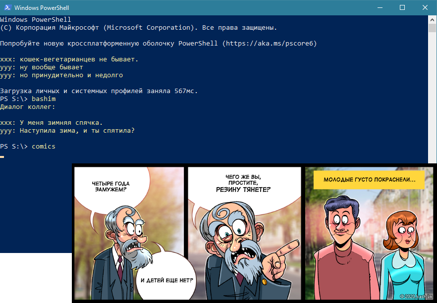

# Bash.Im - Random Quote

Скрипт выводит случайную цитату с сайта http://bash.im из "Лучшего" за неделю, используя RSS feed. 
Так же скрипт может показывать случайный комикс с сайта http://bash.im.
Написан на [***Windows PowerShell***](https://ru.wikipedia.org/wiki/Windows_PowerShell).

### Чтобы цитата выводилась при запуске PowerShell - нужно добавить весь код скрипта в файл профиля.
- Открываем файл профиля (из PowerShell): `notepad $profile`
- Если выходит ошибка, значит файла профиля еще нет - нужно его создать: `New-Item -path $profile -type file -force`, а потом открыть предыдущей командой
- Добавить код и сохранить файл
- Теперь случайная цитата будет выводиться при каждом запуске PowerShell
- Чтобы вывести еще одну цитату нужно набрать команду `bashim`
- Чтобы вывести комикс нужно набрать команду `comics`

***
